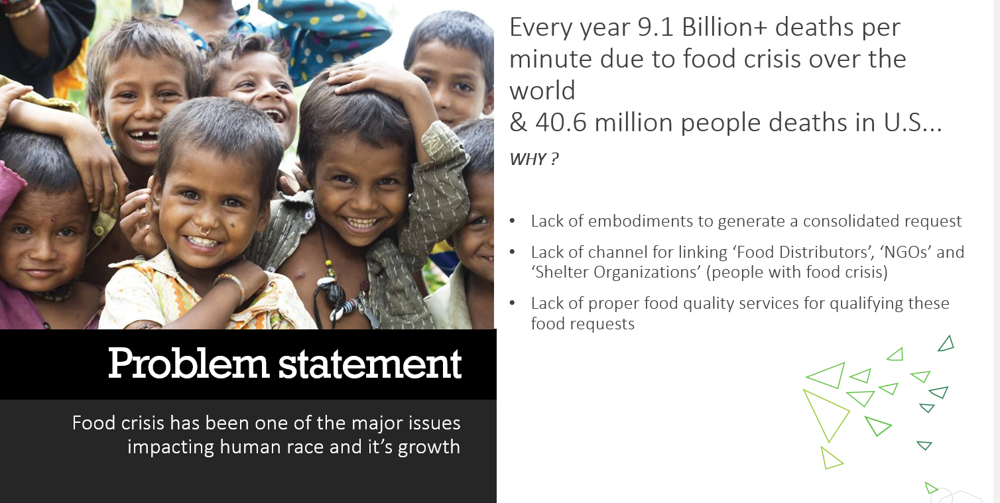
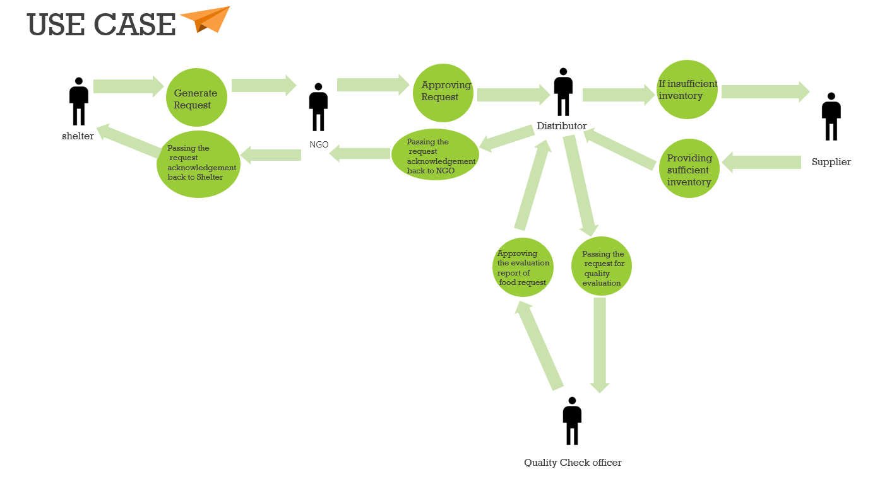
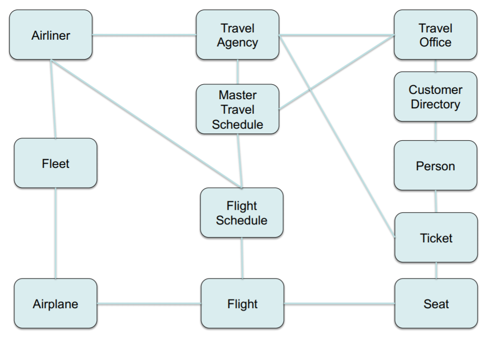

# Aasha Food Management Ecosystem
### Problem Definition and Background
With the increasing number of deaths due to scarcity of food each year, it is necessary for such audience facing food crisis to have proper food requests addressed to the food distributors and suppliers which would also help them to treat all the extra food to the right set of audience with the proper quality evaluation of food. On an average, there are 9.1 billion deaths per minute over the world and 40.6 million people deaths in the United States due to food crisis. In addition to this, it is essential for them to define a set of parameters for evaluating appropriate food request and distributing service and quality evaluating service accordingly. This parameter should be constructed on one’s concern like ‘how can the request reach from shelter house to distributor?’, ‘How can the enterprise flow can be managed?’ ‘How can the list be available to the distributor with NGO approval?’, ‘How will the Distributor take request from multiple requests and send it to Quality Enterprise?’. In addition to these concerns, the quality enterprise itself should be able to see the list of the items provided by distributor and accordingly approve or provide feedback to incoming request and sent confirmation back to NGO & Distributor.

### Proposed Solution
● We target to construct a Food management solution system using software engineering techniques for enhancing the proper utilization for food distributive services provided by the different food enterprise and accordingly design system for solving major food crises problems faced by the shelter enterprises. 
● The Food Management solution will enable the shelter to generate multiple requests to NGO , then the NGO only on approval could send it to other enterprise like Distributor, followed by Distributor sending it to Quality for the provided stock of items, in such a way without compromising the quality of the food, they are delivered to the shelter enterprise and also to avoid any human loss due to scarcity in food services. 
● The considered paradigm system is built on parameters like a request generation, the approval of requests from different enterprise and forwarding it to other enterprise. 
● Our end goal is to design a food management solution system that will generate food requests from different shelters from different cities and accordingly with authorization levels and quality check services, approve the main request and thus make the quality check food delivered to different shelters accordingly.

### Entities
● Entreprise
1. Shelter
2. NGO
3. Distributor
4. Supplier
5. Quality Check

● User Role
1. SysAdmin
2. Shelter Officer
3. NGO Officer
4. Distributor Officer
5. Supplier Officer
6. Quality Check Officer

### Steps to regenrate this project

 - Download File AashaFoodManagementEcosystem
 - Open thie project in Eclipse or Netbeans
 - Compile and clean build the project
 - Run it

# Travel Agency Flight-Booking System
### Problem Definition and Background
With the increasing number of flight bookings each year, it is necessary for a travel agency to have
a flight booking system which would help them add or manage airlines. In addition to this, it is
essential for them to define a set of parameters for managing airlines, managing and updating flight
details from airlines and managing customer booking details accordingly. These parameters should
be constructed on travel agency’s concern like ‘how efficient a system is to allow addition and
updating airlines?’, ‘Can tickets be updated?’ ‘is the option to view recent booking available?’,
‘How good is the system to avoid booking of the same customer’. In addition to managing the
traffic of flights, the travel agency itself should be able to search on customized source and
destination flights and then carry out booking or cancel out booking accordingly.
### Proposed Solution
● We target to construct Travel Agency Flight Management solution using software
engineering techniques for enhancing the management system for Travel agency and
accordingly design and implement its functionality.
● The Travel Agency Flight Management solution will enable Travel agency to add Airline
Directory from which it wishes to support its business and take flight details from airlines
accordingly.
● The Travel agency should be able to add/update/delete multiple airlines and also
add/update/cancel flights from airlines in terms of availability of flights from airliner
● Our end goal is to implement such Flight-Customer management system from Travel
Agency prospective with support for airline management and Flight details management,
customer details management and seat management.

### Object Model

### Steps to regenrate this project

 - Download File AashaFoodManagementEcosystem
 - Open thie project in Eclipse or Netbeans
 - Compile and clean build the project
 - Run it
